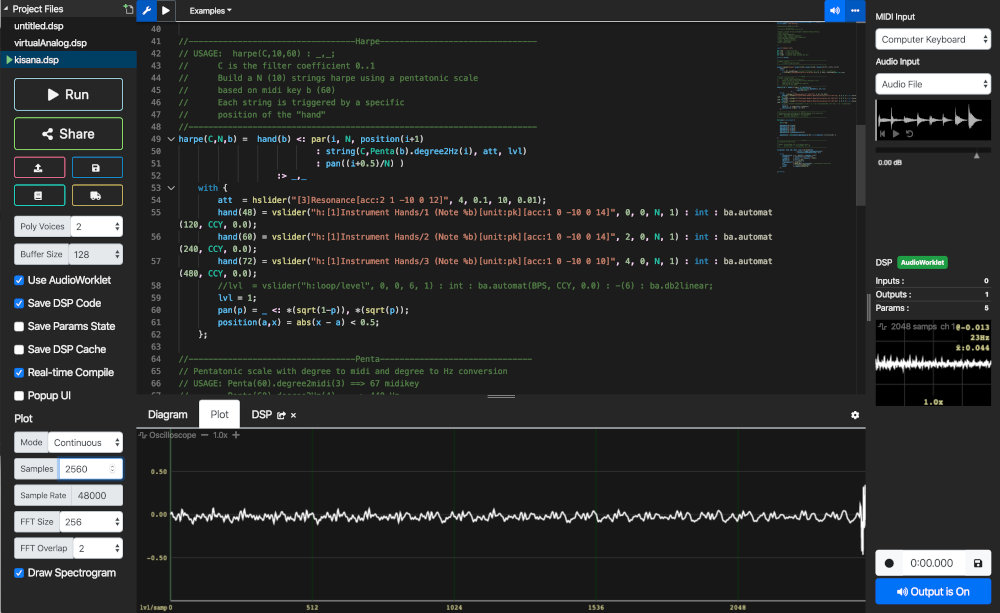
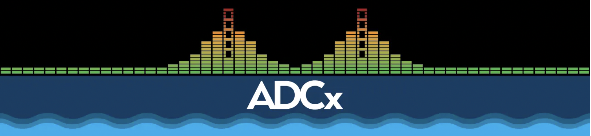
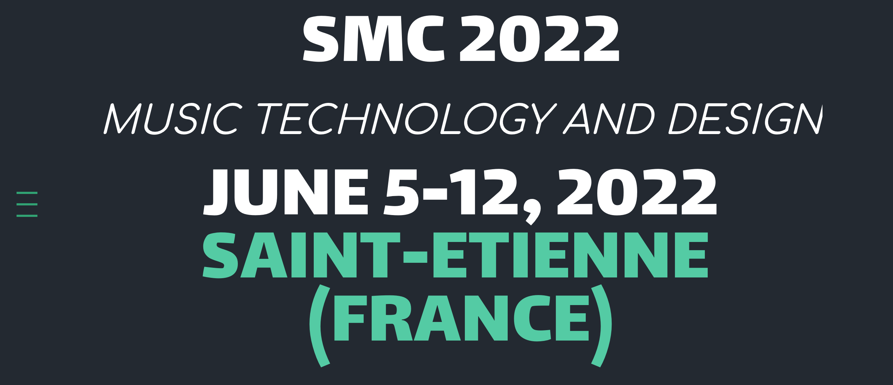
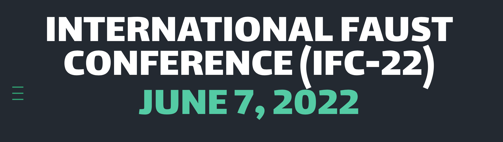
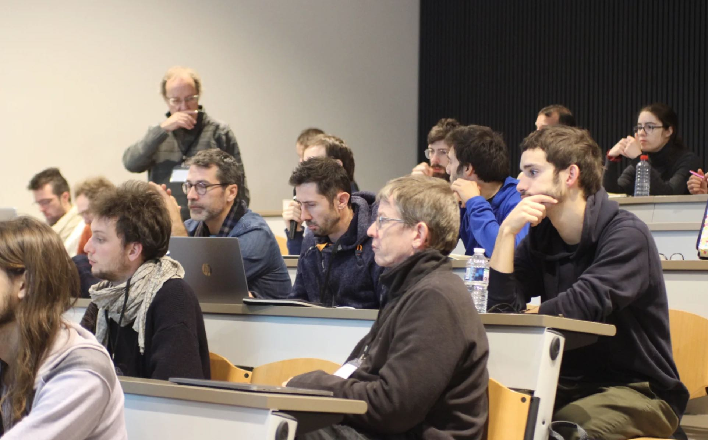
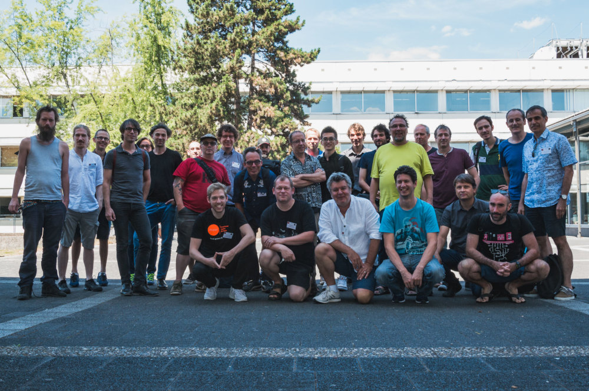

## What is Faust?

Faust (Functional Audio Stream) is a functional programming language for sound synthesis and audio processing with a strong focus on the design of synthesizers, musical instruments, audio effects, etc. created at the [GRAME-CNCM Research Department](https://www.grame.fr/recherche). 

<figure>

</figure>

Faust targets high-performance signal processing applications and audio plug-ins for a variety of platforms and standards.

The core component of Faust is its compiler. It allows to "translate" any Faust digital signal processing (DSP) specification to a wide range of non-domain specific languages such as C++, C, LLVM bit code, WebAssembly, Rust, etc. In this regard, Faust can be seen as an alternative to C++ but is much simpler and intuitive to learn.

Thanks to a wrapping system called "architectures," codes generated by Faust can be easily compiled into a wide variety of objects ranging from audio plug-ins to standalone applications or smartphone and web apps, etc.

<figure>

<figcaption>The <a href="https://faustide.grame.fr">Faust Web IDE</a></figcaption>

</figure>

---

## Getting Started

### If You're in a Hurry

If you’re in a hurry and just wanna have a look at how Faust programs look like, you can simply check the [Faust Examples](https://faustdoc.grame.fr/examples/ambisonics/). 

### If You Wanna Get Started With Faust

If you’re looking for a step by step tutorial of approximately 2 hours that will walk you through writing simple Faust programs and give you an overview of what Faust can do, have a look at our [Quick Start Tutorial](https://faustdoc.grame.fr/manual/quick-start/).

### If You’re Looking for the "Manual"

Faust’s syntax and features are thoroughly documented in the [Faust Manual](https://faustdoc.grame.fr/manual/introduction/). This resource contains hundreds of code examples and many short tutorials.

### If You’re Looking for the Documentation of a Function in the Faust Libraries

The [documentation of Faust's standard libraries](https://faustlibraries.grame.fr/) is automatically generated directly from the libraries' source code.

### If You prefer Video Tutorials

Check out [the Faust Kadenze course](https://www.kadenze.com/courses/real-time-audio-signal-processing-in-faust/info).

### If You want to discover Projects Powered by Faust

Check out the [Powered by Faust](https://faust.grame.fr/community/powered-by-faust/) page.

### If You're looking for Papers on Faust

Check out Faust [papers and reports](https://hal.science/search/index/?q=GRAME+FAUST&rows=30&page=3) on [HAL](https://hal.science/).

---

## Faust News

### **>>** September 09, 2023: faust-web-component released !

Result of [Ian Clester](https://ijc8.me/2023/08/27/gsoc-faust/) Google Summer of Code project, the [faust-web-component](https://github.com/grame-cncm/faust-web-component) package provides two web components for embedding interactive Faust snippets in web pages.

- `<faust-editor>` displays an editor (using [CodeMirror 6](https://codemirror.net/)) with executable, editable Faust code, along with some bells & whistles (controls, block diagram, plots) in a side pane.
This component is ideal for demonstrating some code in Faust and allowing the reader to try it out and tweak it themselves without having to leave the page, and can [been tested here](https://codepen.io/St-phane-Letz/pen/YzdZZoK). 

- `<faust-widget>` just shows the controls and does not allow editing, so it serves simply as a way to embed interactive DSP, and can [been tested here](https://codepen.io/St-phane-Letz/pen/LYMWybP).

These components are built on top of [faustwasm](https://github.com/grame-cncm/faustwasm) and [faust-ui](https://github.com/Fr0stbyteR/faust-ui) packages and is released as a [npm package](https://www.npmjs.com/package/@grame/faust-web-component).

### **>>** September 06, 2023: faust2rnbo released !

  

The [faust2rnbo](https://github.com/grame-cncm/faust/tree/master-dev/architecture/max-msp#faust2rnbo) tool transforms a Faust DSP program into a [RNBO](https://rnbo.cycling74.com) patch containing a rnbo~ object and including the codebox code as a subpatch. The  tool has been deployed on the Faust remote compilation service, to be used from the [Faust Web IDE](https://faustide.grame.fr).

All is explained in [Using Faust in RNBO with codebox~](https://faustdoc.grame.fr/tutorials/rnbo/) tutorial and can be used with the just released [Max 8.5.6 version](https://cycling74.com/forums/max-856-released).

### **>>** August 28, 2023: Google Summer of Code projects finished

  

- **Automatic Differentiation in the Faust Compiler** aimed at adding Automatic differentiation directly in the compiler, so that gradient calculation can be carried out natively in Faust, with applications in Machine Learning algorithms. The project was worked  by [Thomas Rushton](https://github.com/hatchjaw) and completed with this [Pull Request](https://github.com/grame-cncm/faust/pull/939), and finally integrated in the Faust [master-branch](https://github.com/grame-cncm/faust/commit/681a303b8ddc9ef2e67c2cc5d5df83f27323b865). 

- **Better Faust on the Web** aimed at enhancing Faust’s support for the web platform, and was worked on by [Ian Clester](https://ijc8.me/). Transitioning the Faust web tools to a rewritten TypeScript version has been completed and deployed in updated versions of the [Faust editor](https://fausteditor.grame.fr) and [Faust playground](https://faustplayground.grame.fr) and soon in the [Faust Web IDE](https://faustide.grame.fr) with this [Pull Request](https://github.com/grame-cncm/faustide/pull/72). A Faust web component embedding the libfaust JS/WebAssembly compiler has been [developed](https://github.com/ijc8/faust-web-component) and will be used soon in the [Faust documentation](https://faustdoc.grame.fr). The development is fully detailed in this [blog post](https://ijc8.me/2023/08/27/gsoc-faust/). 

Thanks Thomas Rushton and Ian Clester for the hard work during the three months period, and [Agathe Herrou](https://github.com/aherrou), [David Braun](https://github.com/DBraun) and [Jason Freeman](https://distributedmusic.gatech.edu/jason/) for helping mentoring the two projects.

### **>>** May 15, 2023: ADCx San Francisco Audio Dev Talks

  

The Audio Developer Conference San Francisco is a one day meet-up for audio developers by the bay. Two conferences are talking about Faust:

- **High-Level Programming of FPGAs for Audio Real-Time Signal Processing Applications** by Romain Michon, which can be [seen here](https://www.youtube.com/live/fqWL2Qj5eSQ?feature=share&t=3210).

- **Using Faust in JUCE Projects** by Julius Smith, which can be [seen here](https://www.youtube.com/live/fqWL2Qj5eSQ?feature=share&t=27614).

And even the [following one](https://www.youtube.com/live/fqWL2Qj5eSQ?feature=share&t=31043) with ChatGPT generating running Faust code:

- **Democratization of Audio Dev: How it started, Where it's going** by Aurelius Prochazka.

### **>>** May 04, 2023: Two Google Summer of Code projects attributed

  

Two projects have finally been attributed to GRAME:

- **Automatic Differentiation in the Faust Compiler** aims at adding Automatic differentiation directly in the compiler, so that gradient calculation can be carried out natively in Faust, with applications in Machine Learning algorithms. The project will be worked on by [Thomas Rushton](https://github.com/hatchjaw).

- **Better Faust on the Web** aims at enhancing Faust’s support for the web platform: transition the Faust web tools to a rewritten TypeScript version, extend the Faust Web IDE, enhance Faust’s online documentation, and prototype an experimental platform for sharing Faust code on the web. The project will be worked on by [Ian Clester](https://ijc8.me/).

Welcome to both of you in the Faust community !

### **>>** March 24, 2023: Zen Flute 1° price at Guthman Musical Instrument 2023 Competition, with Faust inside !

  

The [Guthman Musical Instrument Competition](https://guthman.gatech.edu) is one of the only competitions of its kind - an event dedicated to identifying the newest and greatest ideas in music. Every year, we invite musical inventors from around the world to share their creations and ideas about the future of music.

This year first price is Keith Bexter with the [Zen Flute](https://www.youtube.com/watch?v=f99xQcFA5ZY), which sound is produced by a physical model of flute [written in Faust](https://museelectronicinstruments.com/?page_id=210), and running on a [Teensy audio board](https://www.pjrc.com/teensy/td_libs_Audio.html).

### **>>** February 22, 2023: GRAME has been selected as a Google Summer of Code 2023 mentor organization

  

[Google Summer of Code](https://summerofcode.withgoogle.com) is a global, online program focused on bringing new contributors into open source software development. GSoC Contributors work with an open source organization on a 12+ week programming project under the guidance of mentors. For the second consecutive year, GRAME has been [selected as a  mentor organization](https://summerofcode.withgoogle.com/programs/2023/organizations/grame) for the Faust project. 

### **>>** December 03, 2022: Programmable Audio Workshop (PAW-22) 

The 5th edition of Programmable Audio Workshop (PAW) will be held on December 3rd at the CITI laboratory of INSA Lyon on the La Doua campus. It will be organized this year by the [EMERAUDE](https://team.inria.fr/emeraude/) (Embedded Programmable Audio Systems) team created in 2022 and associating INSA-Lyon, INRIA and GRAME. With 7 conferences in the morning and 4 workshops in the afternoon, PAW addresses this year the theme of networked embedded audio systems, with a particular focus on spatialized sound and FPGAs (Field-Programmable Gate Arrays).

Full program, details of the talks and registration on the [PAW website](https://paw.grame.fr).

### **>>** October 13, 2022: Google Summer of Code project finished

  

**Faust Integration in HISE** aimed at integrating support for the Faust audio programming language into HISE, an extensive framework for the creation of sample-based virtual musical instruments. The project has been [completed](https://resonant-bytes.de/blog/gsoc-final-submission/) by [Roman Sommer](https://resonant-bytes.de/about/) with the help of [Christoph Hart](https://github.com/christophhart) as mentor, and announced [here](https://forum.hise.audio/topic/6505/faust-is-here).

### **>>** June 5-12, 2022: Sound Music Computing (SMC-22) at Saint-Etienne (France)

[SMC-22](https://smc22.grame.fr) (Sound and Music Computing) is a multifaceted event around acoustics, music, and audio technology. It will take place in Saint-Étienne (France) on June 4-12, 2022 and will have the following theme: Music Technology and Design. As the first "in person" edition of SMC after 2 years of COVID-19 pandemic, we aim at widening the public of this event by (i) broadening the scope of SMC concerts through a digital art festival opened to the public, (ii) involving local schools and publics, and (iii) strengthening connections between academia and the industry.

SMC-22 will be a combination of a [Summer School](https://smc22.grame.fr/school.html) (June 5-7, 2022), the [International Faust Conference](https://smc22.grame.fr/ifc.html) (June 7, 2022), the [SMC Scientific Conference](https://smc22.grame.fr/conferences.html), [Industry-Oriented Events](https://smc22.grame.fr/conferences.html), a [Festival](https://smc22.grame.fr/festival.html) (June 8-11, 2022), and a [STEAM (Science Technology Engineering Arts and Mathematics) Fair - "Faites du son!"](https://smc22.grame.fr/faites.html) (June 9-12).

Most Faust related presentations are obviously part of IFC, but [several SMC presentations](https://smc22.grame.fr/program.html) are related to Faust.

  

### **>>** June 7, 2022: Third International Faust Conference (IFC-22) in conjunction with SMC 2022 at Saint-Etienne (France)

The [International Faust Conference](https://smc22.grame.fr/ifc.html) aims at gathering researchers, developers, musicians, computer artists using the Faust programming language. The Third International Faust Conference (IFC-22) will propose sessions of paper presentations, as well as thematic round tables, demonstrations, and tutorials. Participants are encouraged to present current works, projects, etc. and to discuss future directions for Faust and its community.

IFC-22 is organized by [GRAME-CNCM](https://www.grame.fr), [INRIA](https://inria.fr), and [Université Jean Monnet](https://www.univ-st-etienne.fr) in conjunction with  [SMC 2022](https://smc22.grame.fr). It will take place on June 7, 2022 at the Centre des Savoirs pour l’Innovation (CSI) of the Université Jean Monnet of Saint-Etienne (France).

  

### **>>** May 20, 2022: Two Google Summer of Code projects attributed

  

Two projects have finally been attributed to GRAME:

- **Faust Integration in HISE** aims at integrating support for the Faust audio programming language into [HISE](http://www.hise.audio), an extensive framework for the creation of sample-based virtual musical instruments. The project will be worked on by [Roman Sommer](https://github.com/romsom/).

- **Integrating Faust Into the Bespoke DAW** aims at extending the modular [Bespoke engine](https://www.bespokesynth.com) with Faust, allowing for both static compilation of modules, and potentially dynamic programming within Bespoke. The project will be worked on by [Drew James](https://protodrew.website/).

Welcome to both of you in the Faust community !

### **>>** March 7, 2022: GRAME has been selected as a Google Summer of Code 2022 mentor organization

  

[Google Summer of Code](https://summerofcode.withgoogle.com) is a global, online program focused on bringing new contributors into open source software development. GSoC Contributors work with an open source organization on a 12+ week programming project under the guidance of mentors. GRAME has been [selected as a  mentor organization](https://summerofcode.withgoogle.com/programs/2022/organizations/grame) for the Faust project. 

### **>>** February 5, 2022: Open Science Award for Open Source Research Software for Faust

  

Great birthday present for the 20th anniversary of the Faust language! Developed by Grame since 2002, supported by a whole community of users and contributors, Faust is [one of the four winners](https://www.ouvrirlascience.fr/open-science-free-software-award-ceremony/) of the Open Science Award for Open Source Research Software (documentation category) awarded at the Open Science European Conference (OSEC).

### **>>** December 18, 2021: Programmable Audio Workshop (PAW-21) 

With a combination of talks and workshops, PAW is an intensive day devoted to electronic sounds and programmable audio technologies! The 6 talks and 4 workshops of [PAW 2021](https://paw.grame.fr/), will offer a unique opportunity to discover Procedural Audio in relation with video game engines!

### **>>** February 1, 2021: Faust Physical Modeling Workshop -- Online Event

<iframe width="800" height="450" src="https://www.youtube.com/embed/xQ8aNgMaR5k" frameborder="0" allow="accelerometer; autoplay; clipboard-write; encrypted-media; gyroscope; picture-in-picture" allowfullscreen></iframe>

Faust has been used for the physical modeling of musical instruments for many years now. Various tools have been developed recently to address the needs of various modeling techniques (e.g., finite difference scheme, waveguides, mass interaction, etc.).

The goal of this one day workshop was to provide a series of interactive one-hour tutorials on these tools as well as some background on their related modeling techniques.

It took place online on Feb. 1, 2021, 3-9pm GMT+1. Additional information about this event can be found [here](community/events.md#faust-physical-modeling-workshop).

### **>>** November 21, 2020: Programmable Audio Workshop (PAW-20) -- Online Event

With a combination of talks and workshops, PAW is an intensive day devoted to electronic sounds and programmable audio technologies! PAW-20 will be a fully online event. Information about **the free registration process** will be posted soon!

<figure>

<figcaption>PAW 2019</figcaption>

</figure>

### **>>** December 1-2, 2020: International Faust Conference 2020 (IFC-20) -- Online Event

The [Second International Faust Conference (IFC-20)](https://ifc20.sciencesconf.org/) will take place at the [Maison des Sciences de l’Homme Paris Nord](https://www.mshparisnord.fr/contacts/plan-telephone-adresse/) (Saint-Denis, France) on December 1-2, 2020. It aims at gathering researchers, developers, musicians, computer artists using the Faust programming language to present current works, creations and projects and discuss future directions for Faust and its community. The 2020 edition is organized by the CICM (Centre de Recherches Informatique et Création Musicale) / MUSIDANSE Lab / Université Paris 8.

<figure>

<figcaption>IFC 2018</figcaption>

</figure>

### **>>** FAST Project: Fast Audio Signal Processing Technologies on FPGA

The [FAST project](https://fast.grame.fr/) will start in March 2021! It is funded by the [Agence Nationale de la Recherche](https://anr.fr/) (ANR -- the French National Research Agency). It gathers the strength of [GRAME-CNCM](https://www.grame.fr/), [CITI Lab (INSA Lyon)](http://www.citi-lab.fr/), and [LMFA (École Centrale Lyon)](http://lmfa.ec-lyon.fr/?lang=en) towards two goals:

* facilitate the design of ultra-low latency embedded systems for real-time audio signal processing,
* use such systems in the context of active control of acoustics.

Faust will play a central role in this project.
